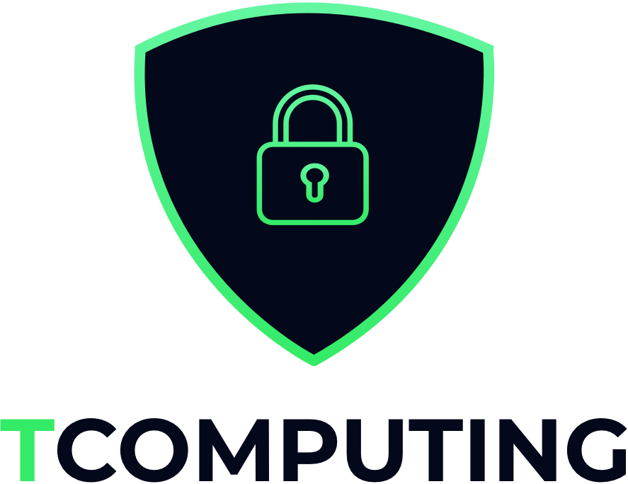

# Les fichiers open source pour le projet fil rouge 🧶

     
    

## Présentation de l'entreprise

L'entreprise de mon fil rouge est une entreprise de sécurité informatique du nom de : TCOMPUTING.

L'entreprise est située au 41 Rue Neuve d’Argenson 24100 à Bergerac.

## Les formules

**L'entreprise proposera plusieurs services/formules :**

### Formule particulier (Vous n’avez peut-être rien à cacher, mais cela ne signifie pas que cela vous convienne que chaque clic ou que vous effectuez est enregistré et vendu à une entreprise qui peut gagner des millions sur votre dos)

- **Audit du client 📖**
  - **Navigateur 🧭**
    - N'utilisez pas le navigateur Google Chrome, mais utilisez Firefox pour naviguer en toute sécurité sans aucun inconvénient.
  - Applications de messagerie instantané 💬
    - N'utilisez pas Messenger, mais utilisez des solutions libre et chiffré de bout en bout telles que Signal.
  - Sécuriser le système d’exploitation
    - Protégez Windows 10 en modifiant les paramètres et fonctions cachés. Modifiez les paramètres dans le BIOS pour éviter de démarrer à partir d'une clé externe.
    - Possibilité de passer sur un système d'exploitation libre.
- **Conseils 👍🏼**
- **Assitance 🕵🏻‍♂️**

### Formule professionnel (Vous pouvez travailler dans des domaines spécifiques tels que les actualités, vos sources et informations de contact doivent donc rester confidentielles. Votre entreprise évolue dans un marché hautement concurrentiel et vous craignez que votre innovation ne soit à la merci de géants technologiques accédant à vos données professionnelles)

- **Audit de l'entreprise 📖**
  - Observez ce que l'entreprise utilise actuellement et apportez des modifications si nécessaire.
- **Installation de Linux sur les ordinateurs 💻**
  - Utilisez un système d'exploitation libre et sécurisé tel que Fedora.
- **Chiffrement des disques dur 💾**
  - Chiffrez le disque dur pour éviter un accès facile aux données et éviter le boot sur des clés USB.
- **Clé Linux Tails pour accéder aux sources du DeepWeb 🕸**
  - Création d'une clé Tails pour accéder aux articles des liens oignon du DeepWeb afin que les journalistes puissent mener des recherches privées et éventuellement utiliser la clé PGP pour crypter la source des e-mails et mener des conversations privées.
- **Sécuriser ses données sur des serveurs centralisés 🔒**
  - Utilisez NextCloud pour créer un serveur NAS.
- **Discuter en entreprise 💬**
  - Utiliser un moyen de communication chiffré de bout en bout et libre.
- **Installation de /e/ sur les téléphones 📱**
  - Installation d’un système d’exploitation libre et dégoogleisé sur les smartphones compatible.
- **Utilisation et explication 💁🏻‍♂️**
  - Instructions complètes et détaillées sur l'application et l'utilisation du système.

## ADN et valeurs de l'entreprise

L'ADN et les valeurs de l'entrerprise sont transparent, sérieux et sécurisé.

## Cible et rayon d'action

**Particuliers 🙋🏻‍♂️** : personnes qui souhaitent protéger les données et/ou qui ne dépendent plus des GAFAM s'inquiètent du fait que leurs données leur soient confiées.

**Professionnels 👩🏼‍💼** : patrons de grandes entreprises et/ou journalistes qui souhaitent communiquer via des méthodes sécurisées et cryptées sans se soucier du vol de leurs données. Les journalistes ont accès à des ressources fiables et peuvent les prévisualiser sur DeepWeb.

- **Cibles principales**
  - TPE et PME cherchant à sécuriser leurs données.
- **Coeur de cible 🎯**
  - Grandes entreprises et métiers sensibles (avocat, journaliste).
- **Cibles secondaires**
  - Particuliers cherchant à se protéger sur internet et sécuriser ses données.

## Concurrence

Je n'ai pas trouvé beacoup de concurrence sur ce marché qui se rapproche le plus possible de ce que je propose. Il y en a trois :

- [Digital Security](https://www.digital.security/fr/)
- [Advens](https://www.advens.fr/fr)
- [Aquitaine Informatque](https://www.aquitaine-informatique.com)
- [National Cyber League](https://nationalcyberleague.org/)

## Les objectifs

**Les objectifs à court terme** sont de contactez le maximum de TPE PME (B2C et B2B) de la région. **Les objectifs à long termes** sont de contactez les plus grandes entreprises nationales et internationales.
De plus, **les objectifs marketing** sont de faire plus de 100 audit par an.
